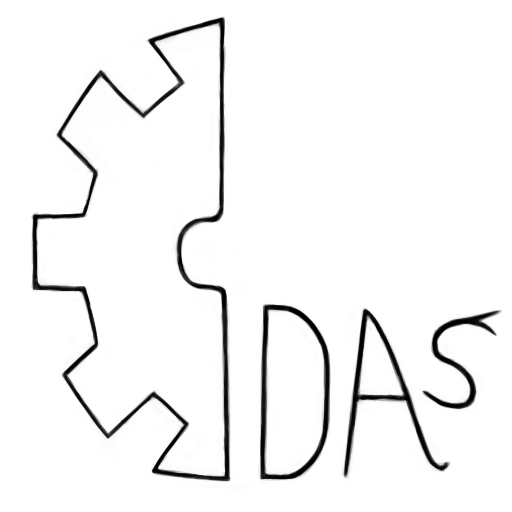

# Dark Assembler language (DAS)

Actually Dark Assembler, Dark Script, Dark, or simply DAS. The name reflects the meaning of the programming language. The main task of the language is to assemble programs into pure machine code from high-level scripts. The language adheres to the principle of free structured programming, as well as reducing memory leaks and the number of operations per processor.

## Ok
